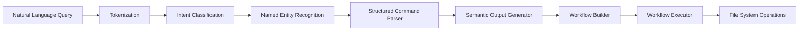

# nlptagger

[](https://goreportcard.com/report/github.com/golangast/nlptagger)
[](https://pkg.go.dev/github.com/golangast/nlptagger)
[](https://github.com/golangast/nlptagger)

[](https://github.com/golangast/nlptagger/blob/main/LICENSE)
[](https://github.com/golangast/nlptagger/stargazers)
[](https://github.com/golangast/nlptagger/graphs/commit-activity)


[](http://makeapullrequest.com)
[](https://github.com/golangast/nlptagger/graphs/commit-activity)
[](https://saythanks.io/to/golangast)

An **intelligent Natural Language Processing (NLP) toolkit** written entirely in **Go** (Golang) that transforms natural language commands into executable workflows. The project features a sophisticated **Mixture of Experts (MoE)** architecture, structured command parsing, contextual awareness, and workflow generation capabilities for building AI-powered project scaffolding and code generation systems.

> **Note:** This project is currently in a beta stage and is under active development. The API and functionality are subject to change. The primary goal is to explore innovative NLP architectures and semantic parsing techniques in Go.

## 🎬 Demo

See the NLP tagger in action:


## Table of Contents

- [🌐 Project Website](https://golangast.github.io/nlptagger/)
- [✨ Key Features](#-key-features)
- [🚀 Getting Started](#-getting-started)
  - [Prerequisites](#prerequisites)
  - [Installation](#installation)
  - [Building from Source](#building-from-source)
- [🛠️ Usage](#️-usage)
  - [Training Models](#1-training-models)
  - [Running MoE Inference](#2-running-moe-inference)
- [⚙️ Project Structure](#️-project-structure)
- [📊 Data & Configuration](#-data--configuration)
- [🗺️ Roadmap](#️-roadmap)
- [Future Direction: Semantic Parsing and Reasoning](#future-direction-semantic-parsing-and-reasoning)
- [🤝 Contributing](#-contributing)
- [📜 License](#-license)
- [🙏 Special Thanks](#-special-thanks)
- [Why Go?](#why-go)

## ✨ Key Features

### 🧠 Advanced NLP Architecture

*   **Mixture of Experts (MoE) Model**: A sophisticated sequence-to-sequence architecture with expert specialization for improved semantic understanding
    - Multi-head attention mechanism with dropout
    - Scheduled sampling during training to prevent exposure bias
    - Capacity dropout for expert load balancing
    - Temperature, top-k, and top-p sampling for diverse generation
    - Entropy regularization to encourage expert diversity
*   **Word2Vec Embeddings**: Generate high-quality distributed word representations from text corpora
*   **Intent Classification**: Accurately categorize user queries into semantic intents (create, delete, move, rename, modify)
*   **Named Entity Recognition (NER)**: Rule-based NER system that extracts entities (filenames, folder names, feature names, component names) from natural language

### 🔧 Structured Command Parsing

Transform natural language into structured, executable commands through a multi-stage pipeline:

```
Natural Language Query → Intent Classification → NER → Structured Command → Semantic Output → Workflow Generation
```

**Supported Command Types:**
- **Creation**: `create folder jack with file jill.go`, `add webserver to myproject`
- **Deletion**: `delete file main.go`, `remove folder temp`
- **Move**: `move file index.html to templates`, `move folder src to lib`
- **Rename**: `rename file old.go to new.go`, `rename folder src to source`
- **Code Modification**: `add authentication to component`, `modify user service`

### 🎯 Contextual Awareness

The system maintains conversational state between commands:
- Tracks all created files and folders
- Maintains current working directory context
- Resolves entity references to full paths
- Enables follow-up commands like "add index.html to templates" after creating a templates folder

### 🚀 Workflow Generation & Execution

Automatically generates and executes dependency-aware workflows:
- Converts semantic output into executable workflow DAGs
- Handles dependencies between operations (e.g., create folder before creating file inside it)
- Supports filesystem operations and code generation
- Extensible architecture for custom resource types

### 📊 Training Enhancements

*   **Scheduled Sampling**: Gradually transition from teacher forcing to model predictions during training
*   **Capacity Dropout**: Dynamically adjust expert capacity to improve load balancing
*   **Gradient Monitoring**: Track gradient norms for debugging and optimization
*   **Early Stopping**: Prevent overfitting with validation-based early stopping
*   **Token Distribution Analysis**: Monitor output diversity to prevent model collapse

## 🚀 Getting Started

### Prerequisites

You need a working **Go environment** (version 1.25 or higher is recommended) installed on your system.

### Installation

1.  **Clone the repository:**

    ```bash
    git clone https://github.com/golangast/nlptagger.git
    cd nlptagger
    ```

### Building from Source

You can build the executable from the root of the project directory:

```bash
go build .
```

This will create an `nlptagger` executable in the current directory.

## 🛠️ Usage

The main executable (`nlptagger` or `main.go`) controls all operations using specific command-line flags. All commands should be run from the root directory of the project.

### 1. Training Models

Train the neural network models using the following commands:

| Model                 | Flag                      | Command                               |
| :-------------------- | :------------------------ | :------------------------------------ |
| **Word2Vec**          | `--train-word2vec`        | `go run main.go --train-word2vec`     |
| **Mixture of Experts (MoE)** | `--train-moe`             | `go run main.go --train-moe`          |
| **Intent Classifier** | `--train-intent-classifier` | `go run main.go --train-intent-classifier` |
| **NER Model**         | `--train-ner`             | `go run main.go --train-ner`          |

**MoE Training Features:**
- Scheduled sampling (gradual transition from teacher forcing)
- Capacity dropout (expert load balancing)
- Gradient norm monitoring
- Token distribution analysis
- Early stopping with validation

To run MoE training with a standalone executable:
```bash
# First build the executable
go build -o train_moe cmd/train_moe/main.go

# Then run training
./train_moe
```

### 2. Running Inference

#### MoE Inference

Run predictions using the trained MoE model:

```bash
go run main.go --moe_inference "create folder myapp with webserver"
```

Or use the standalone inference tool with sampling options:

```bash
go run cmd/moe_inference/main.go \
  -query "create folder jack with file jill.go" \
  -temperature 0.7 \
  -topk 40 \
  -topp 0.9
```

**Sampling Parameters:**
- `-temperature`: Controls randomness (0.1-2.0, default: 1.0)
- `-topk`: Top-K sampling for diverse outputs (default: 50)
- `-topp`: Nucleus sampling threshold (default: 0.95)

### 3. Interactive Scaffolder

The interactive scaffolder provides a conversational REPL interface with persistent context:

```bash
go run cmd/interactive_scaffolder/main.go
```

**Interactive Commands:**
```
> create folder myproject with webserver
✓ Created: myproject/
✓ Created: myproject/main.go
✓ Created: myproject/handler.go

> context
Current directory: myproject/
Files: main.go, handler.go
Folders: templates/, static/

> add index.html to templates
✓ Created: myproject/templates/index.html

> exit
```

### 4. Workflow Generation and Execution

The `example/main.go` program demonstrates the complete pipeline: parsing natural language, generating workflows, and executing them.

```bash
go run ./example/main.go -query "create folder jack with a go webserver jill"
```

**Expected Output:**
```
Processing query: "create folder jack with a go webserver jill"

--- Generated Workflow (after inference and validation) ---
Node ID: Filesystem::Folder-jack-0
  Operation: CREATE
  Resource Type: Filesystem::Folder
  Resource Name: jack
  Dependencies: []

Node ID: Filesystem::File-jill-0
  Operation: CREATE
  Resource Type: Filesystem::File
  Resource Name: jill
  Dependencies: [Filesystem::Folder-jack-0]

Node ID: file-createfile-0
  Operation: WRITE_FILE
  Resource Name: jill
  Command: [webserver template code]
  Dependencies: [Filesystem::File-jill-0]

✓ Workflow executed successfully
```

For interactive mode:
```bash
go run ./example/main.go
```

### 5. Demos and Examples

Explore various capabilities through demo programs:

| Demo                      | Command                                      | Description |
| :------------------------ | :------------------------------------------- | :---------- |
| **Command Structure**     | `go run cmd/command_structure_demo/main.go`  | Shows structured command parsing |
| **Hierarchical Intents**  | `go run cmd/hierarchical_demo/main.go`       | Demonstrates intent hierarchy |
| **Advanced Features**     | `go run cmd/advanced_demo/main.go`           | Shows advanced NLP capabilities |
| **VFS Demo**              | `go run cmd/vfs_demo/main.go`                | Virtual filesystem demonstration |
| **MoE Example**           | `go run cmd/moe_example/main.go`             | MoE architecture example |

### 6. Utility Commands

| Tool                      | Command                                      | Purpose |
| :------------------------ | :------------------------------------------- | :------- |
| **Generate Training Data** | `go run cmd/generate_training_data/main.go` | Create synthetic training data |
| **Inspect Vocabulary**    | `go run cmd/inspect_vocab/main.go`           | View vocabulary contents |
| **Create Vocabulary**     | `go run cmd/create_vocab/main.go`            | Build vocabulary from corpus |
| **Debug Inference**       | `go run cmd/debug_inference/main.go`         | Debug MoE predictions |

## 🧩 Integrating `nlptagger` into Your Projects

This project is more than just command-line tools. It's a collection of Go packages. You can use these packages in your own Go projects.

Example usage is in the /example folder.

```go
package main

import (
	"bufio"
	"flag"
	"fmt"
	"log"
	"os"
	"strings"

	"nlptagger/neural/parser"
	"nlptagger/neural/workflow"
)

var (
	query = flag.String("query", "", "Natural language query for the parser")
)

func main() {
	flag.Parse()

	// Create parser and executor instances
	p := parser.NewParser()
	executor := workflow.NewExecutor()

	// Process initial query from flag, if provided
	if *query != "" {
		processAndExecuteQuery(*query, p, executor)
	}

	// Start interactive loop
	reader := bufio.NewReader(os.Stdin)
	for {
		fmt.Print("\nEnter a query (e.g., \"create folder jack with a go webserver jill\"): ")
		input, _ := reader.ReadString('\n')
		input = strings.TrimSpace(input)

		if input == "exit" || input == "quit" {
			break
		}

		if input != "" {
			processAndExecuteQuery(input, p, executor)
		}
	}
}

func processAndExecuteQuery(q string, p *parser.Parser, executor *workflow.Executor) {
	log.Printf("Processing query: \"%s\"", q)

	// Parse the query into a workflow
	// The parser now handles semantic validation and inference internally.
	wf, err := p.Parse(q)
	if err != nil {
		log.Printf("Error parsing query: %v", err)
		return
	}

	fmt.Println("\n--- Generated Workflow (after inference and validation) ---")
	for _, node := range wf.Nodes {
		fmt.Printf("Node ID: %s, Operation: %s, Resource Type: %s, Resource Name: %s, Properties: %v, Command: %s, Dependencies: %v\n",
			node.ID, node.Operation, node.Resource.Type, node.Resource.Name, node.Resource.Properties, node.Command, node.Dependencies)
	}

	// Execute the generated workflow
	if err := executor.ExecuteWorkflow(wf); err != nil {
		log.Printf("Error executing workflow: %v", err)
		return
	}
}

```


The `neural/` and `tagger/` directories contain the reusable components. Import them as needed.

## ⚙️ Project Structure

The project follows a modular architecture with clear separation of concerns:

```
nlptagger/
├── main.go                    # Main dispatcher for command-line tools
├── go.mod                     # Go module definition
│
├── cmd/                       # Command-line executables
│   ├── train_word2vec/        # Word2Vec training
│   ├── train_moe/             # MoE model training
│   ├── train_intent_classifier/  # Intent classification training
│   ├── train_ner/             # NER model training
│   ├── moe_inference/         # MoE inference with sampling
│   ├── interactive_scaffolder/ # Interactive REPL with context
│   ├── command_structure_demo/ # Structured command parsing demo
│   ├── vfs_demo/              # Virtual filesystem demo
│   ├── advanced_demo/         # Advanced NLP features demo
│   ├── debug_inference/       # MoE debugging tools
│   └── ...                    # Additional utilities
│
├── neural/                    # Core neural network implementations
│   ├── moe/                   # Mixture of Experts architecture
│   │   ├── moe.go             # Main MoE model
│   │   ├── attention.go       # Multi-head attention mechanism
│   │   ├── training.go        # Training loop with enhancements
│   │   └── sampling.go        # Temperature, top-k, top-p sampling
│   │
│   ├── nn/                    # Neural network components
│   │   ├── lstm/              # LSTM implementation
│   │   ├── ner/               # Named Entity Recognition
│   │   ├── embedding/         # Word embeddings
│   │   └── word2vec/          # Word2Vec implementation
│   │
│   ├── semantic/              # Semantic parsing and generation
│   │   ├── intent_classifier.go    # Intent classification
│   │   ├── intent_templates.go     # Semantic output generation
│   │   ├── command_structure.go    # Structured command types
│   │   ├── command_parser.go       # Command parsing logic
│   │   ├── filesystem_context.go   # Contextual state management
│   │   └── entity_extractor.go     # Entity extraction
│   │
│   ├── parser/                # High-level parser
│   │   └── parser.go          # Main NLP parser integrating all components
│   │
│   ├── workflow/              # Workflow generation and execution
│   │   ├── workflow.go        # Workflow DAG structures
│   │   ├── executor.go        # Workflow execution engine
│   │   └── validator.go       # Workflow validation
│   │
│   └── tokenizer/             # Text tokenization utilities
│
├── tagger/                    # NLP tagging components
│   ├── pos_tagger.go          # Part-of-speech tagging
│   └── entity_tagger.go       # Entity tagging utilities
│
├── trainingdata/              # Training datasets
│   ├── intent_data.json       # Intent classification training data
│   ├── wikiqa/                # WikiQA dataset for MoE training
│   └── ...                    # Additional training corpora
│
├── gob_models/                # Saved trained models (.gob files)
│   ├── moe_model.gob          # Trained MoE model
│   ├── word2vec_model.gob     # Trained Word2Vec embeddings
│   └── ...                    # Other model files
│
├── docs/                      # Project website and documentation
│   ├── index.html             # Project website
│   ├── style.css              # Website styling
│   └── script.js              # Website interactivity
│
├── example/                   # Integration examples
│   └── main.go                # End-to-end workflow example
│
├── COMMAND_STRUCTURE.md       # Detailed command structure documentation
├── CONTEXT_SYSTEM.md          # Context system documentation
└── README.md                  # This file
```

## 🏗️ Architecture Overview

### NLP Pipeline

The system uses a multi-stage pipeline to transform natural language into executable workflows:



### Mixture of Experts (MoE) Model

The MoE architecture consists of:

1. **Encoder**: LSTM-based encoder with word embeddings
2. **Expert Network**: Multiple specialized expert heads
3. **Gating Network**: Learns to route inputs to appropriate experts
4. **Attention Mechanism**: Multi-head attention with dropout
5. **Decoder**: LSTM decoder with scheduled sampling

**Key Training Features:**
- **Scheduled Sampling**: Gradually shifts from ground truth to model predictions during training
- **Capacity Dropout**: Randomly adjusts expert capacity to improve load balancing
- **Gradient Monitoring**: Tracks gradient norms to detect vanishing/exploding gradients
- **Token Distribution**: Analyzes output diversity to prevent model collapse
- **Early Stopping**: Validation-based stopping to prevent overfitting

### Structured Command System

Commands are parsed into structured objects with the following components:

```go
type StructuredCommand struct {
    Action       CommandAction    // create, delete, move, rename
    ObjectType   ObjectType       // folder, file, component
    Name         string           // primary entity name
    Keyword      CommandKeyword   // with, and, in, to
    ArgumentType ObjectType       // secondary object type
    ArgumentName string           // secondary entity name
}
```

This structure enables:
- Clear separation of command elements
- Easy validation and debugging
- Type-safe operations
- Extensibility for new command types

## � Supported Commands

### Creation Commands

**Basic Creation:**
```
create folder <name>
create file <name>
add folder <name>
add file <name>
```

**Nested Creation:**
```
create folder <name> with file <name>
create folder <name> with webserver
add folder <name> and file <name>
```

**Examples:**
- `create folder myapp`
- `create file README.md`
- `create folder src with file main.go`
- `create folder api with webserver`

### Deletion Commands

**Syntax:**
```
delete file <name>
delete folder <name>
remove file <name>
remove folder <name>
```

**Examples:**
- `delete file temp.txt`
- `remove folder old_code`

### Move Commands

**Syntax:**
```
move file <name> to <destination>
move folder <name> to <destination>
move file <name> into <destination>
```

**Examples:**
- `move file index.html to templates`
- `move folder utils to lib`
- `move file config.json into settings`

### Rename Commands

**Syntax:**
```
rename file <old_name> to <new_name>
rename folder <old_name> to <new_name>
```

**Examples:**
- `rename file old.go to new.go`
- `rename folder src to source`

### Code Modification Commands

**Syntax:**
```
add <feature> to <component>
modify <component>
```

**Examples:**
- `add authentication to api`
- `add logging to user service`
- `modify user handler`

### Complex Workflows

**Multi-step Creation:**
```
create folder myproject with webserver and database
```

**Generated Structure:**
```
myproject/
├── main.go           # Webserver entry point
├── handler.go        # HTTP handlers
├── db.go            # Database connection
├── models/          # Database models
├── templates/       # HTML templates
└── static/          # Static assets
```

## 📊 Data & Configuration

### Training Data

The project uses several training datasets:

*   **Intent Classification**: `trainingdata/intent_data.json` - Labeled examples for intent recognition
*   **MoE Training**: `trainingdata/wikiqa/` - WikiQA dataset for sequence-to-sequence training
*   **Word2Vec**: Any text corpus in the `trainingdata/` directory

### Model Configuration

**Current Approach:**
Model hyperparameters are defined in the training modules:
- Learning rate, epochs, batch size defined in `cmd/train_*/main.go`
- MoE architecture parameters (num experts, hidden size, attention heads) in `neural/moe/moe.go`
- Training enhancements (scheduled sampling ratio, capacity dropout) in `cmd/train_moe/main.go`

**Typical MoE Hyperparameters:**
```go
NumExperts:      8
HiddenSize:      256
NumAttentionHeads: 4
LearningRate:    0.001
Epochs:          150
BatchSize:       32
ScheduledSamplingRatio: 0.5  // Start at 50% teacher forcing
CapacityDropout:  0.2         // 20% capacity variation
```

### Model Storage

Trained models are saved as `.gob` files in the `gob_models/` directory:
- `moe_model.gob` - Complete MoE model with weights
- `word2vec_model.gob` - Word2Vec embeddings
- `intent_classifier.gob` - Intent classification model
- `vocab.gob` - Vocabulary mappings

## 🗺️ Roadmap

### ✅ Completed Features

- [x] Word2Vec embeddings training and inference
- [x] Mixture of Experts (MoE) architecture with attention
- [x] Intent classification (create, delete, move, rename, modify operations)
- [x] Named Entity Recognition (NER) for extracting file names, folder names, components, features
- [x] Structured command parsing system
- [x] Semantic output generation (JSON format)
- [x] Workflow generation and execution with dependency management
- [x] Interactive scaffolder with persistent context
- [x] MoE training enhancements:
  - [x] Scheduled sampling
  - [x] Capacity dropout
  - [x] Temperature, top-k, top-p sampling
  - [x] Gradient monitoring
  - [x] Token distribution analysis
  - [x] Early stopping
- [x] Rename and move operation support
- [x] Code modification intents (add feature, modify component)
- [x] Contextual awareness system

### 🚧 In Progress

- [ ] Persistent VFS tree for state management across sessions
- [ ] Semantic role tags for context-aware operations
- [ ] Blueprint system for parameterized code generation
- [ ] Dependency graph for automatic refactoring

### 📋 Planned Features

- [ ] Comprehensive unit and integration tests
- [ ] Performance benchmarking suite
- [ ] Externalize model configurations (YAML/JSON)
- [ ] Enhanced error handling and recovery
- [ ] Advanced semantic understanding:
  - [ ] Implicit intent inference
  - [ ] Multi-step reasoning
  - [ ] Constraint satisfaction
- [ ] Additional NLP tasks:
  - [ ] Part-of-Speech tagging improvements
  - [ ] Dependency parsing
  - [ ] Coreference resolution
- [ ] Web API for model serving
- [ ] Model compression and optimization
- [ ] Multi-language support
- [ ] Integration with popular IDEs (VS Code, GoLand)
- [ ] Cloud deployment templates

## 🔮 Future Direction: Advanced Semantic Capabilities

### Vision: Beyond Command Parsing

The long-term goal is to evolve from simple command parsing to **intelligent semantic reasoning** that can understand complex, implicit requirements and generate sophisticated workflows.

### 1. Persistent VFS Tree 🌳

Maintain a complete in-memory representation of the project structure:
- Track all files, folders, and their relationships
- Enable fast lookups and path resolution
- Support "undo" operations by maintaining state history
- Persist state across sessions

```go
type VFSNode struct {
    Name     string
    Type     ResourceType
    Children map[string]*VFSNode
    Metadata map[string]interface{}
    Parent   *VFSNode
}
```

### 2. Semantic Role Tags 🏷️

Assign semantic roles to code elements for context-aware operations:

| Role Tag | Purpose | Example |
|----------|---------|---------|
| `entry_point` | Main application entry | `main.go` |
| `config` | Configuration files | `config.yaml` |
| `api_handler` | HTTP request handlers | `user_handler.go` |
| `model` | Data models | `user.go` |
| `test` | Test files | `user_test.go` |

**Use Cases:**
- "Add logging to all handlers" → Automatically finds files tagged as `api_handler`
- "Create a config file" → Knows to place in `config/` directory
- "Add tests for the user model" → Creates `*_test.go` file with proper imports

### 3. Blueprint System 📐

Parameterized templates for complex code generation:

```yaml
blueprint: rest_api_crud
parameters:
  entity: User
  fields:
    - name: string
    - email: string
    - age: int
generates:
  - models/user.go           # Data model
  - handlers/user_handler.go # CRUD handlers
  - tests/user_test.go       # Unit tests
  - migrations/001_create_users.sql  # Database migration
```

**Example Query:**
```
create rest api for Product with name, price, and description
```

**Generated Output:**
- Complete CRUD API implementation
- Database models and migrations
- HTTP handlers with validation
- Unit tests with coverage
- API documentation

### 4. Dependency Graph for Refactoring 🔗

Intelligent dependency tracking for safe refactoring:

```go
type DependencyGraph struct {
    Nodes map[string]*CodeNode
    Edges map[string][]string  // file -> dependencies
}
```

**Use Cases:**
- "Rename User to Account" → Updates all references across the codebase
- "Move auth package to internal/" → Updates all import paths
- "Extract payment logic to separate service" → Creates new package with moved code and updates callers

### 5. Intelligent Reasoning Examples 🧠

**Query:** "Add authentication to my API"

**System Reasoning:**
1. Detects existing API handlers via semantic roles
2. Generates middleware for authentication
3. Updates handler registrations to use middleware
4. Creates authentication-related models (User, Session)
5. Adds configuration for JWT secrets
6. Generates tests for auth flow

**Query:** "Make the user service publicly accessible"

**System Inference:**
1. Identifies `user_service.go` as internal service
2. Infers need for HTTP/gRPC API layer
3. Generates API handlers/controller
4. Adds route registration
5. Updates firewall/security configuration
6. Creates API documentation

### 6. Multi-Step Workflow Chaining 🔄

Support complex workflows with multiple dependent steps:

**Query:** "Set up a Go microservice with PostgreSQL and deploy to Kubernetes"

**Generated Workflow:**
1. Create project structure
2. Generate database models
3. Create migration files
4. Implement API handlers
5. Add Dockerfile
6. Generate Kubernetes manifests (Deployment, Service, ConfigMap)
7. Create CI/CD pipeline configuration
8. Set up health checks and monitoring


## 🤝 Contributing

We welcome contributions! Please feel free to open issues for bug reports or feature requests, or submit pull requests for any enhancements.

1.  Fork the repository.
2.  Create a new branch (`git checkout -b feature/AmazingFeature`).
3.  Commit your changes (`git commit -m '''Add AmazingFeature'''`).
4.  Push to the branch (`git push origin feature/AmazingFeature`).
5.  Open a Pull Request.

> **Note on Tests:** There is currently a lack of automated tests. Contributions in this area are highly encouraged and appreciated!

## 📜 License

This project is licensed under the **GNU General Public License v3.0**. See the [LICENSE](LICENSE) file for details.

## 🙏 Special Thanks

*   [The Go Team and contributors](https://github.com/golang/go/graphs/contributors) for creating and maintaining Go.

## Why Go?

Go is a great choice for this project for several reasons:

*   **Stability:** The language has a strong compatibility promise. What you learn now will be useful for a long time. ([Go 1 Compatibility Promise](https://go.dev/doc/go1compat))
*   **Simplicity and Readability:** Go's simple syntax makes it easy to read and maintain code.
*   **Performance:** Go is a compiled language with excellent performance, which is crucial for NLP tasks.
*   **Concurrency:** Go's built-in concurrency features make it easy to write concurrent code for data processing and model training.
*   **Strong Community and Ecosystem:** Go has a growing community and a rich ecosystem of libraries and tools. ([Go User Community](https://go.dev/wiki/GoUsers))